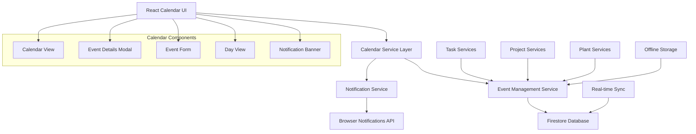

# Design Document

## Overview

The Custom Calendar Implementation replaces the existing Google Calendar integration with a self-contained calendar system built directly into the household management application. The new system provides comprehensive calendar functionality including event management, notifications, and data persistence while maintaining the existing user experience and improving data privacy by eliminating external dependencies.

## Architecture



## Components and Interfaces

### 1. Calendar Data Models

```typescript
interface CalendarEvent {
  id: string;
  userId: string;
  title: string;
  description?: string;
  startDate: Date;
  endDate: Date;
  allDay: boolean;
  type: 'task' | 'project' | 'plant_care' | 'custom';
  sourceId?: string; // ID of the source task/project/plant
  status: 'pending' | 'completed' | 'cancelled';
  recurrence?: RecurrencePattern;
  notifications: NotificationSettings[];
  createdAt: Date;
  updatedAt: Date;
}

interface NotificationSettings {
  id: string;
  type: 'browser' | 'in_app';
  timing: number; // minutes before event
  enabled: boolean;
}

interface CalendarView {
  type: 'month' | 'week' | 'day';
  currentDate: Date;
  events: CalendarEvent[];
  selectedDate?: Date;
}
```

### 2. Calendar Service Layer

```typescript
interface CalendarService {
  // Event CRUD operations
  createEvent(event: Omit<CalendarEvent, 'id' | 'createdAt' | 'updatedAt'>): Promise<CalendarEvent>;
  updateEvent(id: string, updates: Partial<CalendarEvent>): Promise<CalendarEvent>;
  deleteEvent(id: string): Promise<void>;
  getEvent(id: string): Promise<CalendarEvent | null>;
  
  // Event queries
  getEventsForDateRange(startDate: Date, endDate: Date): Promise<CalendarEvent[]>;
  getEventsForDate(date: Date): Promise<CalendarEvent[]>;
  getUpcomingEvents(limit?: number): Promise<CalendarEvent[]>;
  getOverdueEvents(): Promise<CalendarEvent[]>;
  
  // Sync operations
  syncFromTasks(): Promise<void>;
  syncFromProjects(): Promise<void>;
  syncFromPlantCare(): Promise<void>;
  
  // Recurrence handling
  generateRecurringEvents(baseEvent: CalendarEvent, endDate: Date): Promise<CalendarEvent[]>;
  updateRecurringSeries(seriesId: string, updates: Partial<CalendarEvent>): Promise<void>;
}
```

### 3. Calendar Components

#### CalendarView Component
- Monthly grid view with event indicators
- Navigation between months/years
- Event click handling for details
- Responsive design for mobile/desktop

#### EventDetailsModal Component
- Display full event information
- Edit/delete actions
- Navigation to source task/project
- Recurrence series management

#### EventForm Component
- Create/edit custom calendar events
- Date/time pickers
- Recurrence pattern selection
- Notification settings

#### DayView Component
- Detailed view of single day events
- Timeline layout for timed events
- Quick event creation
- Event status management

### 4. Notification System

```typescript
interface NotificationService {
  scheduleNotification(event: CalendarEvent, timing: number): Promise<void>;
  cancelNotification(eventId: string): Promise<void>;
  showInAppNotification(message: string, type: 'info' | 'warning' | 'error'): void;
  requestBrowserPermission(): Promise<boolean>;
  checkUpcomingEvents(): Promise<CalendarEvent[]>;
}
```

## Data Models

### Calendar Events Collection Structure

```
users/{userId}/calendarEvents/{eventId}
{
  id: string,
  userId: string,
  title: string,
  description?: string,
  startDate: Timestamp,
  endDate: Timestamp,
  allDay: boolean,
  type: 'task' | 'project' | 'plant_care' | 'custom',
  sourceId?: string,
  status: 'pending' | 'completed' | 'cancelled',
  recurrence?: {
    type: 'daily' | 'weekly' | 'monthly' | 'yearly',
    interval: number,
    endDate?: Timestamp,
    seriesId: string
  },
  notifications: [{
    id: string,
    type: 'browser' | 'in_app',
    timing: number,
    enabled: boolean
  }],
  createdAt: Timestamp,
  updatedAt: Timestamp
}
```

### Event Synchronization Strategy

1. **Task Events**: Automatically created/updated when tasks are modified
2. **Project Events**: Created for project deadlines and milestone dates
3. **Plant Care Events**: Generated from plant care schedules and recurrence patterns
4. **Custom Events**: User-created events independent of other entities

## Error Handling

### 1. Data Synchronization Errors
- **Conflict Resolution**: Last-write-wins with user notification
- **Network Failures**: Queue operations for retry when online
- **Data Corruption**: Validate event data and provide recovery options

### 2. Notification Errors
- **Permission Denied**: Graceful fallback to in-app notifications
- **Browser Compatibility**: Feature detection and progressive enhancement
- **Timing Issues**: Retry mechanism for failed notification scheduling

### 3. Calendar View Errors
- **Date Range Errors**: Validate date inputs and provide sensible defaults
- **Event Loading Failures**: Show error state with retry option
- **Performance Issues**: Implement pagination and lazy loading for large datasets

## Testing Strategy

### 1. Unit Tests
- Calendar service methods (CRUD operations)
- Event synchronization logic
- Recurrence pattern generation
- Notification scheduling
- Date/time utilities

### 2. Integration Tests
- Calendar component interactions
- Event form submission and validation
- Real-time event updates
- Offline/online synchronization
- Cross-component event propagation

### 3. End-to-End Tests
- Complete calendar workflow (create, view, edit, delete events)
- Task-to-calendar synchronization
- Notification delivery
- Mobile responsiveness
- Browser compatibility

### 4. Performance Tests
- Large dataset rendering (1000+ events)
- Calendar navigation speed
- Event search and filtering
- Memory usage optimization
- Network request efficiency

## Migration Strategy

### Phase 1: Remove Google Calendar Dependencies
1. Remove Google Calendar API calls from existing code
2. Update environment variables and configuration
3. Remove Firebase Functions related to calendar integration
4. Update documentation and deployment scripts

### Phase 2: Implement Core Calendar System
1. Create calendar data models and Firestore collections
2. Implement calendar service layer
3. Build basic calendar view components
4. Add event CRUD operations

### Phase 3: Event Synchronization
1. Implement automatic event creation from tasks/projects/plants
2. Add real-time synchronization
3. Handle event updates and deletions
4. Implement conflict resolution

### Phase 4: Advanced Features
1. Add recurrence pattern support
2. Implement notification system
3. Add calendar views (month/week/day)
4. Optimize performance and add caching

### Phase 5: Testing and Polish
1. Comprehensive testing suite
2. Performance optimization
3. Accessibility improvements
4. Mobile responsiveness refinement

## Security Considerations

### 1. Data Access Control
- Firestore security rules to ensure users can only access their own events
- Validate user authentication for all calendar operations
- Sanitize user input for event creation/editing

### 2. Notification Security
- Validate notification permissions before scheduling
- Prevent notification spam through rate limiting
- Secure handling of notification data

### 3. Data Privacy
- All calendar data stored locally in user's Firestore
- No external API calls or data sharing
- User control over notification preferences and data retention