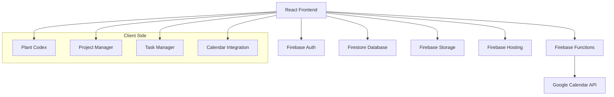

# Design Document

## Overview

The Household Management Application is a responsive web application built on Firebase that provides comprehensive management of plants, projects, and tasks with Google Calendar integration. The application uses a modern web stack with React for the frontend, Firebase for backend services, and Firestore for data persistence.

## Architecture

### High-Level Architecture



### Technology Stack

- **Frontend**: React 18 with TypeScript
- **Styling**: Tailwind CSS for responsive design
- **Backend**: Firebase (Auth, Firestore, Functions, Storage, Hosting)
- **Database**: Firestore (NoSQL, free tier available)
- **File Storage**: Firebase Storage for plant photos
- **Calendar Integration**: Google Calendar API via Firebase Functions
- **State Management**: React Context API with useReducer
- **Routing**: React Router v6
- **Build Tool**: Vite
- **Testing**: Jest + React Testing Library

## Components and Interfaces

### Core Components

#### 1. Authentication System
```typescript
interface User {
  uid: string;
  email: string;
  displayName?: string;
  createdAt: Date;
}

interface AuthContextType {
  user: User | null;
  login: (email: string, password: string) => Promise<void>;
  logout: () => Promise<void>;
  resetPassword: (email: string) => Promise<void>;
}
```

#### 2. Plant Management
```typescript
interface Plant {
  id: string;
  userId: string;
  name: string;
  species?: string;
  description: string;
  photos: PlantPhoto[];
  careTasks: PlantCareTask[];
  createdAt: Date;
  updatedAt: Date;
}

interface PlantPhoto {
  id: string;
  url: string;
  thumbnailUrl: string;
  uploadedAt: Date;
  description?: string;
}

interface PlantCareTask {
  id: string;
  plantId: string;
  title: string;
  description?: string;
  dueDate: Date;
  recurrence?: RecurrencePattern;
  completed: boolean;
  calendarEventId?: string;
}
```

#### 3. Project Management
```typescript
interface Project {
  id: string;
  userId: string;
  title: string;
  description: string;
  status: TaskStatus;
  dueDate?: Date;
  subtasks: Subtask[];
  createdAt: Date;
  updatedAt: Date;
  calendarEventId?: string;
}

interface Subtask {
  id: string;
  projectId: string;
  title: string;
  description?: string;
  status: TaskStatus;
  dueDate?: Date;
  createdAt: Date;
  updatedAt: Date;
  calendarEventId?: string;
}

type TaskStatus = 'todo' | 'in_progress' | 'finished';
```

#### 4. Simple Task Management
```typescript
interface SimpleTask {
  id: string;
  userId: string;
  title: string;
  description?: string;
  dueDate?: Date;
  completed: boolean;
  createdAt: Date;
  updatedAt: Date;
  calendarEventId?: string;
}
```

#### 5. Calendar Integration
```typescript
interface CalendarEvent {
  id: string;
  title: string;
  description?: string;
  startDate: Date;
  endDate: Date;
  reminders: CalendarReminder[];
}

interface CalendarReminder {
  method: 'email' | 'popup';
  minutes: number;
}


```

### Component Hierarchy

```
App
├── AuthProvider
├── Router
│   ├── LoginPage
│   ├── Dashboard
│   │   ├── NavigationBar
│   │   ├── PlantCodex
│   │   │   ├── PlantList
│   │   │   ├── PlantDetail
│   │   │   ├── PlantForm
│   │   │   └── PhotoTimeline
│   │   ├── ProjectManager
│   │   │   ├── ProjectList
│   │   │   ├── ProjectDetail
│   │   │   ├── ProjectForm
│   │   │   └── SubtaskList
│   │   ├── TaskManager
│   │   │   ├── TaskList
│   │   │   └── TaskForm
│   │   └── CalendarView
│   └── NotFoundPage
└── ErrorBoundary
```

## Data Models

### Firestore Collections Structure

```
users/{userId}
├── profile: UserProfile
├── plants/{plantId}: Plant
├── projects/{projectId}: Project
├── subtasks/{subtaskId}: Subtask
├── simpleTasks/{taskId}: SimpleTask
└── plantCareTasks/{taskId}: PlantCareTask
```

### Security Rules
```javascript
rules_version = '2';
service cloud.firestore {
  match /databases/{database}/documents {
    // Users can only access their own data
    match /users/{userId}/{document=**} {
      allow read, write: if request.auth != null && request.auth.uid == userId;
    }
  }
}
```

### Storage Structure
```
users/{userId}/
└── plants/{plantId}/
    └── photos/{photoId}.{extension}
```

## Error Handling

### Error Types and Handling Strategy

1. **Authentication Errors**
   - Invalid credentials: Display user-friendly error message
   - Network errors: Retry mechanism with exponential backoff
   - Session expiry: Automatic redirect to login

2. **Database Errors**
   - Connection failures: Offline mode with local storage
   - Permission errors: Clear error messages and auth check
   - Data validation errors: Field-level validation feedback

3. **File Upload Errors**
   - Size limits: Pre-upload validation and compression
   - Format errors: File type validation
   - Network failures: Resume upload capability

4. **Calendar Integration Errors**
   - API rate limits: Queue system with retry logic
   - Authentication failures: Re-authentication flow
   - Sync failures: Manual retry options

### Error Boundary Implementation
```typescript
interface ErrorBoundaryState {
  hasError: boolean;
  error?: Error;
}

class ErrorBoundary extends Component<Props, ErrorBoundaryState> {
  // Catch and handle React component errors
  // Provide fallback UI and error reporting
}
```

## Testing Strategy

### Unit Testing
- **Components**: Test rendering, user interactions, and state changes
- **Hooks**: Test custom hooks with React Testing Library
- **Services**: Test Firebase service functions with mocks
- **Utilities**: Test helper functions and data transformations

### Integration Testing
- **Authentication Flow**: Login, logout, and session management
- **CRUD Operations**: Create, read, update, delete for all entities
- **Calendar Integration**: Event creation and synchronization
- **File Upload**: Photo upload and storage functionality

### End-to-End Testing
- **User Workflows**: Complete user journeys from login to task completion
- **Cross-Device Testing**: Responsive behavior on different screen sizes
- **Offline Functionality**: App behavior without internet connection

### Performance Testing
- **Load Testing**: Database queries with large datasets
- **Image Optimization**: Photo loading and display performance
- **Bundle Size**: JavaScript bundle optimization and lazy loading

## Responsive Design Strategy

### Breakpoints
- **Mobile**: 320px - 768px
- **Tablet**: 768px - 1024px
- **Desktop**: 1024px+

### Mobile-First Approach
- Base styles for mobile devices
- Progressive enhancement for larger screens
- Touch-friendly interface elements
- Optimized navigation for small screens

### Key Responsive Features
- **Navigation**: Hamburger menu on mobile, sidebar on desktop
- **Data Tables**: Horizontal scroll on mobile, full table on desktop
- **Forms**: Single column on mobile, multi-column on desktop
- **Images**: Responsive sizing with appropriate aspect ratios
- **Typography**: Scalable font sizes and line heights

## Security Considerations

### Authentication Security
- Firebase Auth handles secure password storage
- Password reset functionality via email
- Session management with automatic expiry

### Data Security
- Firestore security rules enforce user data isolation
- Input validation and sanitization
- XSS protection through React's built-in escaping

### File Upload Security
- File type validation
- Size limits enforcement
- Virus scanning (if needed in future)
- Secure URL generation for photo access

## Performance Optimization

### Frontend Optimization
- Code splitting with React.lazy()
- Image lazy loading and optimization
- Memoization of expensive calculations
- Virtual scrolling for large lists

### Backend Optimization
- Firestore query optimization with indexes
- Efficient data structure design
- Caching strategies for frequently accessed data
- Batch operations for multiple updates

### Network Optimization
- Service worker for offline functionality
- Request debouncing for search and filters
- Optimistic updates for better UX
- Compression for image uploads