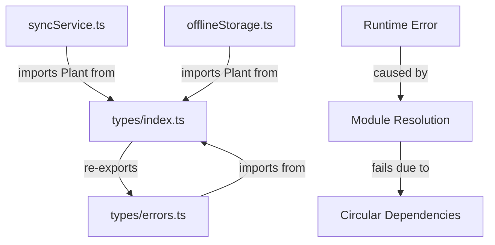
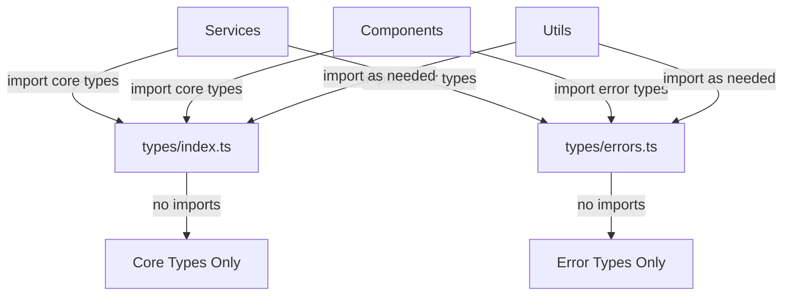

# Design Document

## Overview

The TypeScript module resolution issues in the household management application stem from circular dependencies, incorrect import paths, and improper use of TypeScript interfaces as constructors. This design addresses these issues through systematic refactoring of the type system, standardization of import paths, and elimination of circular dependencies.

## Architecture

### Current Problem Analysis

The application is experiencing several critical issues:

1. **Circular Dependencies**: The main `types/index.ts` was re-exporting from `types/errors.ts`, while `errors.ts` was importing from `index.ts`
2. **Module Resolution Failures**: Runtime errors where modules cannot find exported types despite them being properly defined
3. **Incorrect Type Usage**: Code attempting to use interfaces as constructors (e.g., `new AppError()`)
4. **Inconsistent Import Paths**: Some modules importing from wrong locations after refactoring

### Root Cause Analysis



## Components and Interfaces

### Type System Restructure

#### 1. Core Types Module (`types/index.ts`)
```typescript
// Contains all core entity types
export interface Plant { ... }
export interface Project { ... }
export interface SimpleTask { ... }
export interface PlantCareTask { ... }
export interface Subtask { ... }

// Service interfaces
export interface AuthService { ... }
export interface DatabaseService { ... }
export interface CalendarService { ... }

// Utility types
export interface ApiResponse<T> { ... }
export interface PaginationOptions { ... }
```

#### 2. Error Types Module (`types/errors.ts`)
```typescript
// Self-contained error types without imports from index
export const ErrorCode = { ... } as const;
export type ErrorCode = typeof ErrorCode[keyof typeof ErrorCode];

export interface AppError {
  code: ErrorCode;
  message: string;
  details?: Record<string, any>;
  timestamp: Date;
  userId?: string;
}

// Factory function instead of constructor
export function createAppError(
  code: ErrorCode,
  message: string,
  details?: Record<string, any>,
  userId?: string
): AppError;
```

#### 3. Import Path Standards
```typescript
// Core entity types
import { Plant, Project, SimpleTask } from '../types';

// Error types and utilities
import { ErrorCode, AppError, createAppError } from '../types/errors';

// Mixed imports (when needed)
import { Plant } from '../types';
import { createAppError } from '../types/errors';
```

## Data Models

### Module Dependency Graph (Fixed)



### Type Resolution Strategy

1. **Eliminate Circular Dependencies**
   - Remove all re-exports between `index.ts` and `errors.ts`
   - Make each module self-contained
   - Use explicit imports where types are needed

2. **Standardize Import Patterns**
   - Core entity types: `import { Type } from '../types'`
   - Error types: `import { ErrorType } from '../types/errors'`
   - Mixed imports: Use separate import statements

3. **Fix Constructor Usage**
   - Replace `new AppError()` with `createAppError()`
   - Use factory functions for complex type creation
   - Ensure proper TypeScript interface usage

## Error Handling

### Module Resolution Error Prevention

1. **Static Analysis**
   - TypeScript compiler checks for circular dependencies
   - ESLint rules for import path consistency
   - Build-time validation of module exports

2. **Runtime Validation**
   - Module loading error detection
   - Graceful fallbacks for missing exports
   - Development-time error reporting

3. **Import Validation**
   - Automated checks for correct import paths
   - Validation of export availability
   - Type-only import usage where appropriate

## Testing Strategy

### Module Resolution Testing

1. **Build-Time Tests**
   - TypeScript compilation without errors
   - Webpack/Vite bundle analysis
   - Import path validation

2. **Runtime Tests**
   - Module loading verification
   - Type instantiation tests
   - Service dependency injection tests

3. **Integration Tests**
   - Cross-module type usage
   - Service interaction with proper types
   - Error handling with correct error types

## Implementation Strategy

### Phase 1: Dependency Analysis and Planning
- Map all current import/export relationships
- Identify circular dependencies
- Plan refactoring sequence to avoid breaking changes

### Phase 2: Core Type System Fixes
- Remove circular dependencies between type modules
- Standardize export patterns in main types index
- Ensure all core types are properly exported

### Phase 3: Error System Refactoring
- Make error types module self-contained
- Replace interface constructors with factory functions
- Update all error usage across the application

### Phase 4: Import Path Standardization
- Update all import statements to use correct paths
- Ensure consistent import patterns across modules
- Validate that all imports resolve correctly

### Phase 5: Validation and Testing
- Run TypeScript compilation to verify fixes
- Test application startup and module loading
- Verify all features work with corrected types

## Performance Considerations

### Module Loading Optimization
- Eliminate unnecessary re-exports that can cause bundling issues
- Use tree-shaking friendly export patterns
- Minimize circular dependencies that can affect module loading order

### TypeScript Compilation
- Reduce compilation time by eliminating circular dependencies
- Improve IDE performance with cleaner module structure
- Enable stricter TypeScript settings for better type safety

## Security Considerations

### Type Safety
- Ensure all error types maintain proper structure
- Validate that factory functions create properly typed objects
- Maintain type safety across module boundaries

### Import Security
- Prevent accidental exposure of internal types
- Ensure proper encapsulation of error handling utilities
- Maintain clear boundaries between public and private APIs